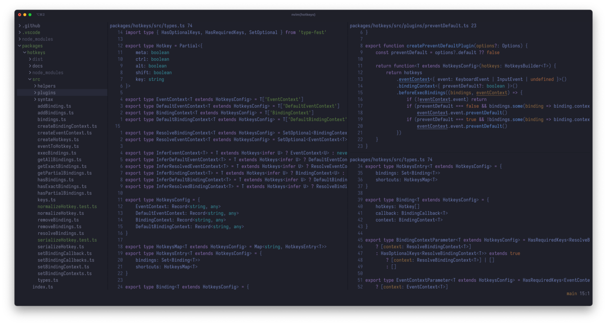

```sh
git clone --recursive https://github.com/sorin-ionescu/prezto.git
git clone https://github.com/zsh-users/zsh-syntax-highlighting.git
git clone https://github.com/zsh-users/zsh-autosuggestions
```

```sh
asdf plugin add bun
asdf plugin add golang
asdf plugin add lua
asdf plugin add neovim
asdf plugin add nodejs
asdf plugin add pnpm
asdf plugin add rust
asdf plugin add stylua
```

```sh
ln -s $HOME/Development/dotfiles/.zshrc $HOME/.zshrc
ln -s $HOME/Development/dotfiles/.gitconfig $HOME/.gitconfig
ln -s $HOME/Development/dotfiles/.tool-versions $HOME/.tool-versions

ln -s $HOME/Development/dotfiles/.config/nvim $HOME/.config
ln -s $HOME/Development/dotfiles/.config/ghostty $HOME/.config
ln -s $HOME/Development/dotfiles/.config/starship.toml $HOME/.config
```

```sh
:Lazy restore

brew bundle install
brew bundle dump --force
brew bundle cleanup --force

asdf install
asdf list
asdf latest $NAME
asdf plugin update --all
```
